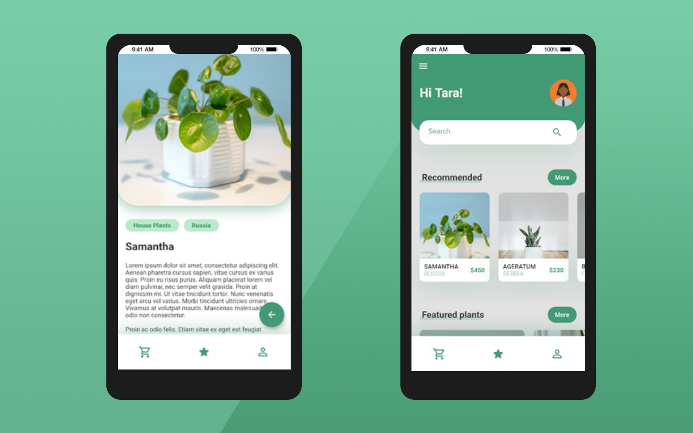

# Flutter Application - Plantify

Plantify is a very simple application made for practicing the first steps using Flutter and Android Studio. 
Its focus is mostly on UI design, featuring a homepage, and a plant details page where users would be able to read in detail about a specific herb. 

## Tools Used

- Android Studio 4.2.2
- Flutter 2.2.3

## Resources

- [YouTube - The Flutter Way](https://www.youtube.com/channel/UCJm7i4g4z7ZGcJA_HKHLCVw)
- [Flaticon](https://www.flaticon.com/) - SVG/PNG icons
- [Unsplash](https://unsplash.com/) - Copyright free HD photos

## Screenshots

